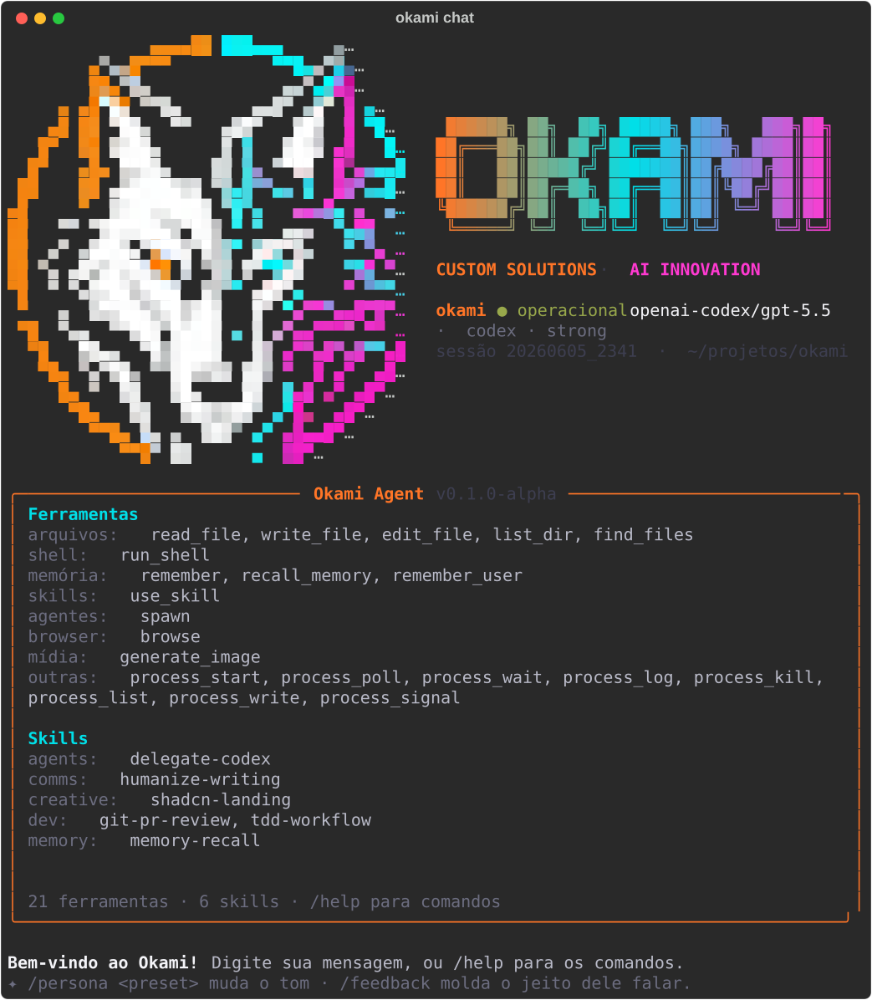
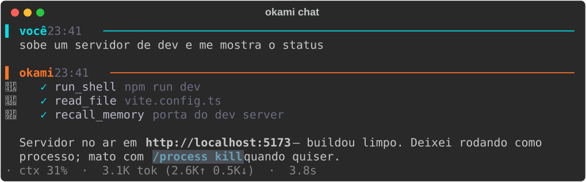
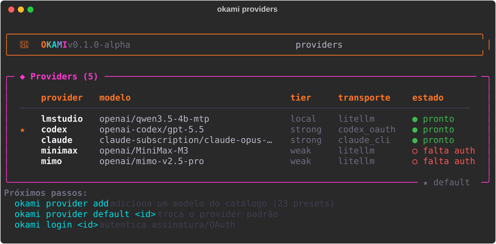
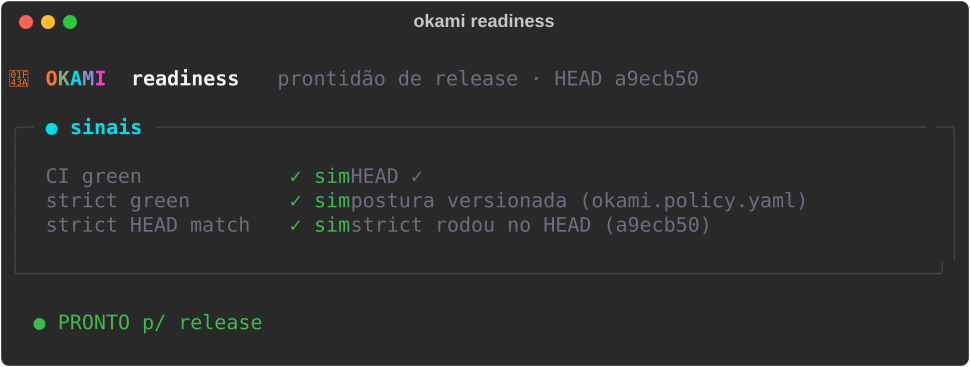

<!-- 🇧🇷 [Português](README.pt-BR.md) · **English** -->
<div align="center">

**English** · [Português](README.pt-BR.md)

# 🐺 Okami Agent

**Sovereign AI for SMBs.**
A **reliable** coding agent with **capability parity across LLMs**, **self-improvement**
(skills · persona · memory) and **mandatory adherence to design systems** — in the terminal, on Telegram,
or wherever you want.


**[🌐 okamiagent.com](https://okamiagent.com)** · **[📚 Documentation](https://okamiagent.com/docs)** · **[🎨 Landing (source)](https://github.com/OkamiOps/Okami-Agent-LP)**

</div>

---

> 🐺 **Public beta (`v0.15-beta`).** Okami is open for you to try. The command/config surface may
> still change before GA — before exposing it publicly, run `okami policy check --strict` first.
> Feedback is very welcome. See the [CHANGELOG](CHANGELOG.md).

> ### ✨ New in `v0.15-beta` — Native Tools & Provider Control
> This release hardens the execution core and removes provider routing from the center of the agent.
> **39 commits · 4,075 tests passing**.
> - **Native tool streaming with atomic history** — structured tool-call deltas, crash-safe resume and
>   compaction that never separates a call from its result.
> - **Request-scoped cancellation** — total/TTFB/idle deadlines, cooperative abort, interruptible retry
>   and no recovery work after a terminal cancellation.
> - **Provider runtime boundary** — immutable runtime targets, one resolver and a transport registry;
>   LiteLLM remains available as a compatibility adapter instead of acting as the architecture.
> - **Telegram model control** — secure inline model picker, `/providers`, persistent session selection,
>   safer callbacks, live heartbeat and generated media delivered to the chat.
> - **OAuth, skills and hardening** — six-provider login flow, 30+ built-in skills, credential-safe file
>   enumeration, anti-hammer/floundering guards and a repository-wide clean Ruff gate.
>
> Full notes in the [CHANGELOG](CHANGELOG.md) and [RELEASE_NOTES](RELEASE_NOTES.md).

`okami chat` opens a **full-screen TUI** in the brand identity (Onyx + Heat Orange / Volt Cyan):



Every turn has clear separation, per-event emoji (🧠 thinking · 🛠️ tool) and a **per-response cost
footer** (ctx · tokens · time) — so you know exactly what it cost:



**Multi-model parity** with subscription-only auth (Codex/Claude via OAuth/CLI, LMStudio local,
MiniMax/MiMo via Token Plan), with automatic fallback:



And release-readiness is a single command (`okami readiness` — CI green · strict green · strict on HEAD):



> Full documentation at **[okamiagent.com/docs](https://okamiagent.com/docs)**. In the repo:
> [Architecture](docs/ARCHITECTURE.md) · [Roadmap](docs/ROADMAP.md) · [Structure](docs/STRUCTURE.md) ·
> [Production/GA](docs/PRODUCTION.md) · [Competitive research](docs/COMPETITIVE_RESEARCH.md).

---

## Why Okami exists (the two pains)

1. **Unreliable harness** — the agent says *"I'll do it"* and doesn't act; when pushed, says *"hold on,
   I'm on it"* and never finishes. A loop with no action invariant and no real completion detection.
2. **Doesn't adhere to skills / design system** — you ask for ShadCN/HeroUI and it invents ugly CSS.
   The skill is a suggestion, not a **gate**; no mechanical verification.

Okami solves both **by construction** (a harness with *action-or-terminate* + *verification gates*)
and takes the rest further: real memory, **self-improvement**, an **evolving persona** and **taste that
learns** — all pluggable and working **with any LLM** (from GPT-5/Claude to your local model in
LMStudio).

---

## Highlights

| | |
|---|---|
| 🧠 **Reliable harness** | *Action-or-Terminate*, anti-loop, anti-hallucination, mechanically verified *exit criteria*. JSON protocol **+** native tool-calling (dual-mode). |
| 🔀 **Multi-model parity** | LMStudio (local), **Codex/GPT-5**, **Claude**, MiniMax, MiMo — with **automatic fallback** between them. **Subscription-only** (OAuth/CLI), never pay-as-you-go. |
| 🎨 **Design-system adherence** | *Contracts* (ShadCN/HeroUI) + *verification gates* that **reject** inline hex, raw CSS, and imports outside `@/components/ui`. |
| 🧬 **Self-improvement** | A **model-driven learning loop** (Hermes-style): after clean turns, a background fork decides — via tools, behind a *"Do NOT capture"* gate — what's worth saving to memory/skills; a **curator** consolidates and archives (reversible). Plus an evolving persona (SOUL/VOICE/PERSONA, go/no-go) and a **taste model**. |
| 🗄️ **Pluggable memory** | `sqlite-fts5` (default), holographic, Honcho, or layered — with embeddings, **auto-compaction** and source citation. |
| 🛡️ **Fail-closed security** | Real sandbox (Docker), persistent go/no-go approval, anti-SSRF guard, central secret redactor, MCP *trust store*, checkpoint journal with HMAC. |
| 📜 **Authored conformance** | Versioned `okami.policy.yaml` + `okami policy check` (CI gate) + `--strict` (production/GA posture). |
| 💬 **Multi-channel** | Terminal (TUI), Telegram (inline buttons), Slack, Discord, Mattermost, Email, **HTTP API**, Paperclip, **ACP** (Zed/VS Code IDE) — plus outbound to **WhatsApp · Signal · Matrix · SMS · iMessage (BlueBubbles) · DingTalk · WeCom · QQ · WeChat**. |
| 🔭 **Observability** | Event log with `trace_id`, per-turn **trajectory replay**, `doctor --json/--lint`, usage + cost per session, audit log. |
| ⚙️ **Operable** | Background processes with an **interactive PTY**, cron, hooks, config hot-reload, disk cleanup, auth profiles. |

---

## Installation

**The only prerequisite is `git`.** The installer uses [uv](https://docs.astral.sh/uv/) as its engine —
it downloads Python, creates the isolated environment and installs everything. **You don't need Python
installed** and you won't fight long-path issues on Windows (uv uses a short directory).

**Linux / macOS / WSL:**
```bash
curl -fsSL https://raw.githubusercontent.com/OkamiOps/Okami-Agent/main/scripts/install.sh | bash
```

**Windows (PowerShell):**
```powershell
irm https://raw.githubusercontent.com/OkamiOps/Okami-Agent/main/scripts/install.ps1 | iex
```

Then (reopen the terminal if `okami` isn't found):
```bash
okami setup     # configure in 2-3 clicks (detects your providers)
okami chat      # chat in the terminal
```

**Everything in one folder — `~/.okami/`** (or `$OKAMI_HOME`), like `~/.openclaw`/`~/.hermes`: the
installer doesn't scatter across the OS. The code lives in `~/.okami/src`, the isolated venv in
`~/.okami/tools`, the launcher in `~/.okami/bin`, and the data (skills, agents, sessions, `.env`,
credentials) in `~/.okami/` at runtime.

**Update: `okami upgrade`** — pulls the latest code into `~/.okami/src` and reinstalls in place,
printing old → new version. Re-running the installer (`curl … | bash` / `irm … | iex`) does the
same thing and is safe to run again anytime. Uninstall: `uv tool uninstall okami-agent`.

<details><summary><b>Dev (run from source, without a global install)</b></summary>

```bash
uv sync                       # create the venv + deps from pyproject
uv run okami doctor           # runs without activating anything
uv run okami chat
# editable global:  uv tool install -e .   (reload new deps with --force)
make test                     # = uv run pytest -q   (full pytest suite)
```
Without uv: `python -m venv .venv && . .venv/bin/activate && pip install -e ".[dev]"`
(on Windows use a short path for the venv — e.g. `C:\okv` — because of litellm's long paths.)
</details>

<details><summary><b>Docker (any OS)</b></summary>

```bash
make docker-build                                            # docker build -f deploy/Dockerfile (multi-stage, uv, non-root)
docker compose -f deploy/docker-compose.yml run --rm okami setup   # first run: configure providers
docker compose -f deploy/docker-compose.yml run --rm okami doctor
docker compose -f deploy/docker-compose.yml run --rm okami task "create hello.txt" -e file_exists:hello.txt
docker run --rm --entrypoint python okami-agent -m pytest -q  # run the suite in the Linux image
```
State (skills, agents, sessions, `.env`, credentials — i.e. `$OKAMI_HOME`) persists in the named
volume `okami-data` (mounted at `/data`), independent of the repo bind-mount — it survives
`docker compose down` (only `down -v` wipes it). To update, `git pull` and re-run `make docker-build`.
> For an LMStudio on the host machine, point `api_base` at `http://host.docker.internal:PORT/v1`.
</details>

**Optional extras** (`uv sync --extra <name>`): `voice` (Whisper + Edge TTS) · `browser`
(Playwright) · `honcho` (Honcho memory) · `dev` (pytest).

---

## First steps

```bash
okami                      # command overview (= okami help)
okami setup                # configuration wizard (arrow menus ↑↓)
okami doctor               # diagnoses config, keys and connectivity
okami chat                 # chat in the terminal (TUI with a persistent session)
okami chat "say hi"        # one question and exit (scripts/pipe)
okami task "create a /health endpoint in FastAPI" \
  -e file_exists:app/health.py -e "file_contains:app/health.py:/health"
okami gateway              # bring up the Telegram bots (1 per agent)
```

- **Configuration** is always via **arrow menus** (↑↓ Enter); without an interactive terminal it falls back to a numbered menu.
- **Secrets** go in `.env` (project) or `$OKAMI_HOME/.env` (global, default `~/.okami/.env`) — **never** in `okami.yaml`, which is versioned.
- Without installing the entry point, you can run it with `python -m okami.cli ...`.

---

## The reliable harness (solves Pain #1)

The heart of Okami is a ReAct loop with **reliability invariants** — not "let the model chat until it
gets tired":

- **Action-or-Terminate** — every step EITHER runs a tool OR terminates explicitly
  (`task_complete` / `task_blocked` / `need_input`). There's no infinite "I'm thinking".
- **Verified exit criteria** — you declare the criterion (`file_exists:x`, `file_contains:x:txt`,
  `cmd_succeeds:pytest -q`) and the harness **checks it mechanically** before accepting completion. If
  the model declares `task_complete` but the criterion fails → `complete_rejected`, it keeps going.
- **Anti-loop / anti-stall** — action *fingerprints* detect repetition; read-only commands don't fool
  the watchdog (`shell_has_effect`).
- **Dual-mode** — JSON protocol (`{"tool": ..., "args": ...}`) for parity across LLMs **and** native
  tool-calling (Codex Responses API; opt-in per provider).
- **Checkpoints & rollback** — every write records the previous state in an append-only journal with a
  **lock + chained HMAC**; `okami rollback N` undoes the last N writes.
- **Budget** — a step/token ceiling per turn; *auto-compaction* of history when the context fills up.

---

## Skills, Contracts & Verification Gates (solves Pain #2)

- **Skills** (`skills/<name>/SKILL.md`) are versioned procedures the agent loads on demand
  (`use_skill`). Several ship in the box: `frontend-shadcn`, `frontend-heroui`, `tdd`, `writing-plans`,
  `delegate-codex`, `humanizer`, `kanban-orchestrator`, …
- **Supply-chain** — every installed skill goes through a **security scan** (prompt injection, malware,
  secret exfiltration, *trojan-source*, hidden unicode); **HIGH/CRITICAL is blocked**. A
  `skills-lock.json` (sha256) detects tampering.
- **Contracts** (`okami.yaml → contracts.ui`) declare the design system: `library: shadcn`,
  `forbid_inline_hex`, `forbid_raw_css`, `require_component_source`.
- **Verification gates** — `okami gate <dir>` (and the internal gates) mechanically **reject** code that
  violates the contract. The skill stops being a suggestion and becomes a **gate**.

---

## Self-improvement that doesn't learn garbage (model-driven, Hermes-aligned)

The agent learns from experience **without polluting itself** — the harness only *times the question*;
the **model decides** what's worth keeping, behind hard filters:

- **Model-driven review** — after a clean turn, every few turns, a **background fork** (tools restricted
  to memory/skill writes, runs *after* you have your answer) decides what — if anything — to save via
  `remember`/`remember_user`/`manage_skill`. "Nothing to save" is a valid outcome. No mechanical
  per-task distiller anchored on your phrasing (that was the garbage factory).
- **"Do NOT capture" gate** — a **deterministic** filter (not just a prompt) blocks the classic noise even
  if a weak model slips: environment/setup failures, *negative tool claims* ("X is broken" → hardens into
  self-citing refusals), transient errors, one-off task narratives. It captures the **fix**, never
  "this doesn't work".
- **Provenance** — auto-created skills are marked `origin: agent`; user-authored/installed ones are
  untouchable by automation.
- **Curator** (`okami curator`) — the slow tier: archives auto-skills unused past N days (LRU) and folds
  narrow/duplicate ones into class-level umbrellas. **Never deletes** (moves to `.archive/` after a
  tar.gz snapshot); `okami curator rollback` undoes a pass, `--dry-run` previews, `pin` exempts. Schedule
  it weekly with `okami curator schedule`.
- **Clean up legacy noise** anytime: `okami skills --prune` · `okami memory prune`.

---

## Providers & multi-model parity

A router via **LiteLLM** + custom transports. **Hard policy: Claude and Codex are ALWAYS by
subscription (OAuth/CLI), NEVER pay-as-you-go.**

| Provider | Model (default) | Auth | Tier |
|---|---|---|---|
| **lmstudio** | `qwen3.5-4b-mtp` (local) | local api_key | local |
| **codex** | `gpt-5.5` | **OAuth device flow** (`okami login codex`) | strong |
| **claude** | `claude-opus-4-8` | **official `claude` CLI** (subscription) | strong |
| **minimax** | `MiniMax-M3` | **Token Plan Subscription Key** (`MINIMAX_API_KEY`) | weak |
| **mimo** | `mimo-v2.5-pro` | **Token Plan API key** (`MIMO_API_KEY` in `.env`) | weak |

- **Automatic fallback** — each provider has a chain (`codex → [claude, minimax, lmstudio]`); if the
  primary goes down (529/timeout/empty response) the turn *fails over* without dying.
- **Adaptive capability profile** — `tier` (`strong`/`weak`/`local`) and `tool_mode`
  (`json_constrained`) prepare the agent for the model you have.
- **Live discovery** — `okami provider models <name>` lists models via `/v1/models`, otherwise falls
  back to the catalog. Switch the session model with `/model <id>` and reasoning effort with `/think`.
- **Usage & cost** — tokens (incl. *cache read*) and cost accumulated per session; `okami status`/`/usage`.
  By-vendor breakdown with **`okami cost`** (subscription = "included", never invents a $ figure).
- **Free Gemini tier (Google Code Assist)** — **`okami gemini login`** authenticates a Google account via
  OAuth PKCE against the Code Assist control plane (cloudcode-pa), the same free tier the official
  `gemini-cli` uses — no billing. Point a provider at `transport: gemini_cloudcode` after login.
  Credentials live in `~/.okami/auth/google_oauth.json` (0600); `okami gemini quota` shows the daily budget.
- **Mixture-of-Agents** — **`okami moa "<hard problem>"`** (and the `mixture_of_agents` tool) routes one
  prompt through *all your configured providers in parallel* and synthesizes the best answer with the
  strongest one — reasoning amplification under the subscription-only constraint (no key pool). Reference
  answers enter the synthesizer wrapped as untrusted data, so a compromised provider can't inject instructions.

---

## Semantic diagnostics on write (LSP client)

Okami can act as an **LSP client**: it spawns external language servers (pyright, gopls,
`typescript-language-server`, rust-analyzer, bash, clangd) and feeds their `publishDiagnostics` into the
**post-write delta filter** — so a `write_file`/`edit` surfaces the *semantic* errors it introduced (with a
diff-aware line-shift so an unchanged-but-moved error isn't reported as new). Git-gated (only inside a
repo). Inspect with **`okami lsp status | list | which <id>`**; nothing is auto-installed without you asking.

---

## Pluggable memory

- **Backends**: `sqlite-fts5` (default, BM25), **holographic** (`dim=1024` vectors), **Honcho** (SaaS),
  or **layered**. **Hybrid** search (lexical + embeddings when available; degrades to BM25 offline).
- **Write policy** — classifies each fact (fact/preference/decision/skill/error), **blocks the
  ephemeral/trivial**, and applies the **"Do NOT capture"** gate so auto-learning never persists
  environment failures or "tool is broken" claims (see *Self-improvement* above).
- **Source citation** — every injected memory comes with `[category · source · confidence]`.
- **Auto-compaction** — when the context fills up, old turns become *summary* nodes without losing the thread.
- **Scope + global memory** — `scope` (global/workspace/…) per item; with `memory.global`,
  `scope=global` preferences live in `~/.okami` and apply in **any** project, while one project's memory
  does **not** contaminate another. Schema with `confidence`, `expires_at` (TTL) and `supersedes_id`
  (consolidation).
- **Auditing** — every recall is logged (`retrieval_logs`); `okami memory explain <id>` shows where the
  memory came from and when/why it surfaced. `forget` (removes) and `archive` (removes, marked) are
  reversible in history.
- **Consolidation** (heuristic, no LLM) — post-task and via `okami memory consolidate`: expires stale
  TTLs and merges near-duplicates (marks `superseded`, **does not delete**), respecting confidence
  (won't demote an explicit preference because of a weak inference).
- **Persona Compiler** (`okami/learning/compiler.py`) — a SHORT per-turn steering block (read-only):
  pulls toward precision when a casual chat has a technical subject, and adapts the opening to the
  person's emotional state (without distorting the solution). The whole identity (SOUL/VOICE/PERSONA)
  is always injected; this is only the per-turn delta.
- CLI: `okami memory add|search|list|explain|forget|archive|consolidate|export` (`--global` for home).
  Identity/core files (`SOUL/VOICE/PERSONA/AGENTS/USER/MEMORY`) are always injected (configurable limits).

---

## Self-improvement (goes beyond Hermes)

- **Evolving persona** — `SOUL.md` (who it is), `VOICE.md` (how it talks), `PERSONA.md` (tone). They
  evolve from feedback (`/feedback`, `okami persona-evolve`) **with go/no-go + changelog + rollback**.
  `SOUL.md` **never** evolves on its own.
- **Taste model** — `okami taste like|dislike|different`: approvals become *attractors*, rejections
  become *repulsors*, and the resulting *steering* is injected into UI prompts.
- **Closed learning loop** — a non-trivial, successful task is reflected on and can **distill a new
  skill** (which still goes through the security scan).

---

## The terminal (TUI)

`okami chat` is a **full-screen Textual TUI**, in the Okami identity (Onyx/Bone + Heat Orange
`#ff7527` · Volt Cyan `#00dfe8` · Neon Magenta `#ff39d1`):

- **Fixed regions** — header · scrollable log · approval panel · input · pinned status bar.
- **Type while the agent works** — FIFO queue; 1 worker, no race (via `call_from_thread`).
- **Live tool-calls** — each step shows ✓/✗; *loop detected* and *approval* are signaled.
- **Button approval** — go/no-go without typing; **Ctrl-C** aborts the turn, **Ctrl-D** exits.
- **Mouse + scroll**, status with a *spinner* and a context *gauge*.
- **Graceful fallback** — without a TTY (pipe/CI) it drops to a concurrent REPL; `--no-tui` forces the simple REPL.

Inside the chat, **`/` commands** (from a single declarative registry — help, autocomplete, "did you
mean"):

| category | commands |
|---|---|
| session | `/new` `/stop` `/retry` `/compact` `/sessions` `/resume <n>` `/export [file]` `/exit` |
| control | `/steer <text>` (inject into the running turn without cancelling) `/busy steer` |
| model | `/model [id]` `/models` `/think <level>` |
| identity | `/feedback <text>` `/persona <preset>` `/undo` `/like` `/dislike` `/different` |
| info | `/help` `/commands` `/status` `/usage` `/tools` `/whoami` |
| system | `/yolo` `/normal` `/config` `/reload` |

---

## Channels & Gateway

A single `Channel` interface; every channel is *deny-by-default* (explicit allowlist).

- **Telegram** — inline buttons for approval (with an anti-stale **nonce**), message *split* >4096,
  retry/backoff, per-turn dedup, *typing*, and voice note → transcription.
- **Slack · Discord · Mattermost** — REST-polling, same interface, anti-loop (ignores its own bot).
- **HTTP API** — `okami serve` (POST `/chat`, **Bearer `OKAMI_API_TOKEN`** fail-closed, bind `127.0.0.1`).
- **Paperclip** — `okami heartbeat` picks up the assigned issue and works on it (with go/no-go).
- **ACP** — `okami acp`: the IDE (Zed/VS Code) drives Okami via the Agent Client Protocol.

`okami gateway` brings up **1 bot per agent**; `okami room` is a **multi-agent brainstorm** with a
moderator that decides who speaks (or no one), with cooldown and anti-stampede caps.

> **Security default:** without `allow_chats`, the bot **responds to no one** (deny-by-default).
> Open it with `channels.telegram.allow_chats: [<your_id>]` (or `allow_all: true`, insecure).

---

## Voice, image, browser and processes

- **Voice** — `okami voice` (turn-based: speak into the mic → the agent responds **out loud**),
  `okami transcribe` (local Whisper), `okami say` (Edge TTS).
- **Image** — `okami image "..."` (gpt-image-2 via Codex subscription, native — no pay-as-you-go API key
  needed; `--ref photo.png` for image-to-image editing in the same call).
- **Browser** — the `browse` tool (Playwright; without it, read-only *fetch*) — **every URL goes
  through the anti-SSRF guard**. A **persistent session** (login → dashboard → report without
  re-navigating) with `scroll`/`back`/`press`/`eval` (guarded)/`close_session`, screenshots as native
  image blocks, JS dialog auto-dismiss, and an idle reaper so a 24/7 VPS never leaks a Chromium process.
- **PDF editing** — the `editar-pdf` skill (`pypdf`, lazy dep): info/extract/metadata/patch/rotate/
  merge/split.
- **Background processes** — `process_start/poll/wait/log/list/kill/write/signal`: run a long command
  without blocking the turn, with on-disk state that **survives a restart**, an **interactive PTY**
  (`process_write` sends stdin), `notify_on_complete`, `watch_patterns` with *strikes*, and orphan
  *reconcile*. All under the same sandbox policy as `run_shell`.

---

## Security model

*Fail-closed* security is Okami's differentiator for real/exposed use. (Operational details in
[docs/PRODUCTION.md](docs/PRODUCTION.md).)

- **Subscription-only & secrets** — Claude/Codex always via OAuth/CLI; keys only in `.env`
  (project or global `$OKAMI_HOME/.env`, default `~/.okami/.env`, `chmod 600`), **never** in the
  versioned YAML. `config set` refuses a literal secret in a dotted key and tells you to use `${ENV}`.
- **Go/no-go approval** — modes `manual` · `smart` (auto-approves low risk) · `off`
  (**fail-closed**: no prompt = denies the sensitive action) · `yolo` (explicit per-session bypass).
  An approval is a **persistent single-use object** (`approval_id`, `args_hash`, `expires_at`,
  `used_at`) — clicking again (even after a restart) is refused, and it's bound to the **exact args** of
  the action.
- **Sandbox** — a **local** backend (cwd + sanitized env + timeout + output ceiling + rlimits) or
  **docker** (real isolation: `--network none`, **non-root**, `--cap-drop ALL`, read-only rootfs, only
  the workspace mounted, no-new-privileges). `dev` / `hardened` / `hardened-strict` profiles,
  **per-surface hardening** (Telegram/API/… harden by default) and an **egress allowlist** via a
  filtering proxy (with internal-network blocking).
- **Anti-SSRF** — `okami/core/net_guard.py`: every user/model-controlled URL validates the http(s)
  scheme, resolves the host and **refuses** loopback/private/link-local (incl. `169.254.169.254`
  metadata) and re-validates each redirect.
- **Central redactor** — secrets (keys, Bearer, JWT, AWS/GitHub/Slack tokens) are masked before they
  reach a log, tool output, the audit (`.okami/audit.jsonl`) or the model's context.
- **File-safety** — workspace *jail* (anti path-traversal/symlink), atomic writes, size ceiling.
- **MCP trust store** — per-tool capabilities (read/write/network/shell/secret-access), trust levels
  (`untrusted`/`reviewed`/`trusted`), HTTPS/local-only, and go/no-go per capability; a tool from an
  untrusted server **without a manifest** requires approval (it doesn't trust a pretty name).
- **Integrity checkpoints** — journal under a lock, **chained HMAC** (tampering/inserting breaks the
  chain → rollback ignores the forged entry).

---

## Conformance & Policy

OpenClaw *policy* style: the posture is an **authored, versioned artifact**.

```bash
okami policy check            # evaluate config+workspace against okami.policy.yaml (CI gate)
okami policy check --strict   # PRODUCTION/GA posture (exposed without real isolation = FAIL)
okami policy show [--strict]  # effective policy
okami policy init             # scaffold an okami.policy.yaml
okami doctor --lint           # posture lint (pass/warn/fail) — approval, secrets, sandbox, MCP…
okami auth list               # auth profiles (type/status/where the credential lives — never its value)
okami status --json           # resolved status for monitoring
```

`okami.policy.yaml` governs: `approvals.mode_allow`, the allowlist of **providers** and **models**,
channel **ingress** (forbids `allow_all`), MCP **trust**, secrets out of the YAML, gateway exposure,
tool metadata and retention. The `--strict` mode (production overlay) is the **GA-readiness gate**.

---

## Observability

- **Event log** — `.okami/events.jsonl` (append-only, redacted timeline, with a per-turn `trace_id`).
- **Trajectory replay** — `okami replay` lists the turns; `okami replay <trace>` reconstructs the turn
  (▶ start · 🧠 llm · ✓✗ step · ⚠ approval · ⨯ failure · ■ outcome); `--json` for tooling.
- **Doctor** — `okami doctor` (config/keys/toolchain/sandbox), `--json` (health for CI), `--fix`
  (orphan lock, `.env` perms, temp), `--lint` (posture).
- **Audit & usage** — `.okami/audit.jsonl` (every tool + approval decision) and tokens/cost per session.
- **Cleanup** — `okami clean [--deep]` (orphan lock, temp, audio, sessions, checkpoints, process logs).

---

## Command reference (CLI)

<details><summary><b>See all commands</b></summary>

| Command | What it does |
|---|---|
| `okami setup` | Configuration wizard (providers, login, memory, identity, channel). |
| `okami chat [msg]` | Chat in the terminal (TUI); `-a <agent>`, `--no-tui`. |
| `okami task <goal> -e <crit>` | Run the harness until COMPLETE/BLOCKED/NEEDS_INPUT/FAILED. |
| `okami run <prompt> [-p prov]` | Raw round-trip to the provider (no session/harness). |
| `okami doctor [--json\|--fix\|--lint]` | Diagnosis / health / repair / posture lint. |
| `okami status [--json]` | Resolved view (agent, model, providers, toggles). |
| `okami login <provider>` | Authenticate a subscription provider (device flow / CLI). |
| `okami provider add\|list\|remove\|default\|login\|models` | Manage providers (arrow menu). |
| `okami model [alias] [--save] [--json]` | Switch/pick model by alias or tier (`sonnet`, `fast`, `smart`, …). |
| `okami auth list\|status` | Auth profiles (metadata, no secrets). |
| `okami policy check\|init\|show` | Authored conformance (`--strict` for GA). |
| `okami config show\|get\|set\|unset\|path\|edit\|check` | Effective config (secret → `.env`). |
| `okami memory add\|search\|list\|explain\|forget\|archive\|consolidate\|stats\|export` | Hybrid memory + auditing/CRUD/consolidation/metrics (`--global` = `~/.okami` home). |
| `okami taste like\|dislike\|different\|show\|steer` | Design taste model. |
| `okami persona-init\|persona-evolve\|persona-log\|persona-rollback` | Evolving identity. |
| `okami skills` / `okami learn <source>` / `okami scan <path>` | Skills + security scan. |
| `okami agent new\|list` | Multi-agent (`agents/<id>`). |
| `okami gateway` / `okami serve` / `okami room` | Telegram bots / HTTP API / multi-agent room. |
| `okami service install\|start\|stop\|status` / `okami logs -f` | Gateway as an OS service (launchd/systemd, starts at boot) + live log. |
| `okami ps` / `okami process log\|kill\|signal\|wait\|clean` | Supervise the agent's background processes from the terminal (real kill, signals, PTY). |
| Telegram: `/providers` · `/model` picker · `/thoughts` · reactions 👀/👍/👎 · approval buttons ✅/❌ | Native Telegram provider/model UX. |
| `okami cron add\|list\|remove\|run\|tick` | Scheduling. |
| `okami hooks` / `okami mcp` | Event hooks / MCP servers. |
| `okami voice` / `okami transcribe` / `okami say` / `okami image` | Voice, STT, TTS, image. |
| `okami paperclip` / `okami heartbeat` / `okami acp` / `okami route` | Paperclip / ACP / routing. |
| `okami gate <dir>` | Design verification gate. |
| `okami events` / `okami replay [trace]` | Timeline / trajectory replay. |
| `okami rollback [N]` / `okami clean [--deep]` | Undo writes / disk cleanup. |
| `okami moa <prompt>` | Mixture-of-Agents: fan out to your providers + synthesize the best answer. |
| `okami gemini login\|status\|quota` | Free Gemini tier (Google Code Assist) via OAuth PKCE. |
| `okami lsp status\|list\|which` | Language servers for semantic diagnostics on write/edit. |
| `okami dashboard` / `okami desktop [--native]` | Web dashboard / native OS window (no Electron). |
| `okami sessions list\|show\|export` | Inspect chat sessions from the terminal (scriptable). |
| `okami cost [--json]` / `okami insights` | Cost by vendor / cross-session usage analytics. |
| `okami tools` / `okami tune` / `okami version` | Agent tools / auto-tune / version. |

</details>

## Agent tools

27 tools declared with **category · tier · sensitivity** (`okami tools` lists them; an anti-drift test
ensures every tool has metadata):

`respond` `read_file` `write_file` `edit_file` `list_dir` `find_files` · `run_shell` ·
`process_start/poll/wait/log/list/write/signal/kill` · `remember` `recall_memory` `remember_user` ·
`use_skill` · `spawn` (subagent) · `mixture_of_agents` · `browse` · `generate_image` · `finish_setup`
`task_complete` `task_blocked` `need_input`.

The **per-surface policy** restricts what each channel can do (e.g. Telegram without `run_shell`, an
even more restricted group); sensitive actions always go through go/no-go.

---

## Configuration

| File | Role | Versioned? |
|---|---|---|
| `okami.yaml` | Base config (providers, memory, contracts, voice, learning). | ✅ yes |
| `okami.local.yaml` | Local overrides (e.g. LMStudio IP). | ❌ gitignored |
| `.env` / `$OKAMI_HOME/.env` (default `~/.okami/.env`) | **Secrets** (API keys, tokens). | ❌ gitignored |
| `okami.policy.yaml` | Authored conformance posture. | ✅ yes |

Each provider has a `model` (LiteLLM string), an optional `api_base`, `api_key_env`/`api_key`,
`transport`, `tier`, `fallback` and `capability`. A secret never goes in the YAML —
`okami config set OPENAI_API_KEY <v>` routes it to `.env`;
`okami config set providers.x.api_key '${OPENAI_API_KEY}'` references it via env.

> **Language (i18n):** the UI is **English by default**, with Portuguese available. Switch with
> `okami --lang pt`, `OKAMI_LANG=pt`, or `lang: pt` in `okami.yaml`.

---

## Development & CI

```bash
make test           # uv run pytest -q   → full suite
make doctor
bash scripts/secret-scan.sh              # same gate as CI (allowlist via `# pragma: allowlist secret`)
```

CI (`.github/workflows/ci.yml`) is a **real gate** (no `|| true`), with **SHA-pinned** actions:

- **test** — `pytest` + **`okami policy check --json`** (conformance, with an artifact) + wheel build + smoke.
- **secret-scan** — shared script (CI ≡ pytest); the fake test vector is marked and auditable.
- **security** — **Ruff** · **Bandit (HIGH)** · **pip-audit** (CVE) · **Semgrep** (`p/security-audit`).

> CodeQL requires GitHub Advanced Security (unavailable on a private repo) → swapped for **Semgrep**,
> which runs 100% on the runner and surfaces findings in the log.

---

## Project structure

```
okami/
  core/        harness, tools, sandbox, approval, redact, net_guard, file_safety,
               policy, lint, processes, ptyproc, egress_proxy, reload, tool_registry…
  llm/         providers, transports (codex/claude/minimax), usage, retry, errors
  memory/      sqlite-fts5 / holographic / honcho / layered, policy, citation, embeddings
  channels/    telegram, slack, discord, mattermost, paperclip (+ _http base)
  gateway/     AgentEndpoint, GroupEndpoint, sessions, checkpoints, approvals
  cli/         _app, _shared, commands/ (basics, task, chat, config, policy, auth, …)
  voice/       bridge, tts, stt          observability/  events, trajectory
  learning/    reflection → memory → skill          skills/  lockfile + scan
  i18n.py · locales/   en (default) + pt
agents/        multi-agent profiles (agents/<id>/agent.yaml + identity)
skills/        versioned skills (frontend-shadcn, tdd, …)
docs/          ARCHITECTURE · ROADMAP · STRUCTURE · PRODUCTION · COMPETITIVE_RESEARCH
deploy/        Dockerfile + docker-compose.yml      scripts/  install.sh/.ps1 · secret-scan.sh
tests/         full suite (pytest)
```

---

## Documentation

- 🌐 **Site**: [okamiagent.com](https://okamiagent.com) — product overview.
- 📚 **Docs**: [okamiagent.com/docs](https://okamiagent.com/docs) — full usage guide.
- 🎨 **Landing (source)**: [github.com/OkamiOps/Okami-Agent-LP](https://github.com/OkamiOps/Okami-Agent-LP).
- 📦 **Releases**: [github.com/OkamiOps/Okami-Agent/releases](https://github.com/OkamiOps/Okami-Agent/releases) · [CHANGELOG](CHANGELOG.md).

In the repository:
- [docs/ARCHITECTURE.md](docs/ARCHITECTURE.md) — full architecture (harness, skills, providers, memory,
  self-improvement, multi-agent, security).
- [docs/PRODUCTION.md](docs/PRODUCTION.md) — GA checklist + how to turn on the hostile posture.
- [docs/ROADMAP.md](docs/ROADMAP.md) · [docs/STRUCTURE.md](docs/STRUCTURE.md) ·
  [docs/COMPETITIVE_RESEARCH.md](docs/COMPETITIVE_RESEARCH.md) (Hermes × OpenClaw × Okami).

---

## License

[MIT](LICENSE) © 2026 OkamiOps. Use it, fork it, ship it commercially — no strings attached, no
warranty. That's the whole point.

---

<div align="center">

**Okami Agent** — © OkamiOps · [okamiagent.com](https://okamiagent.com). Built with
[uv](https://docs.astral.sh/uv/) · [LiteLLM](https://github.com/BerriAI/litellm) ·
[Textual](https://textual.textualize.io/).

*Custom Solutions · AI Innovation*

</div>
