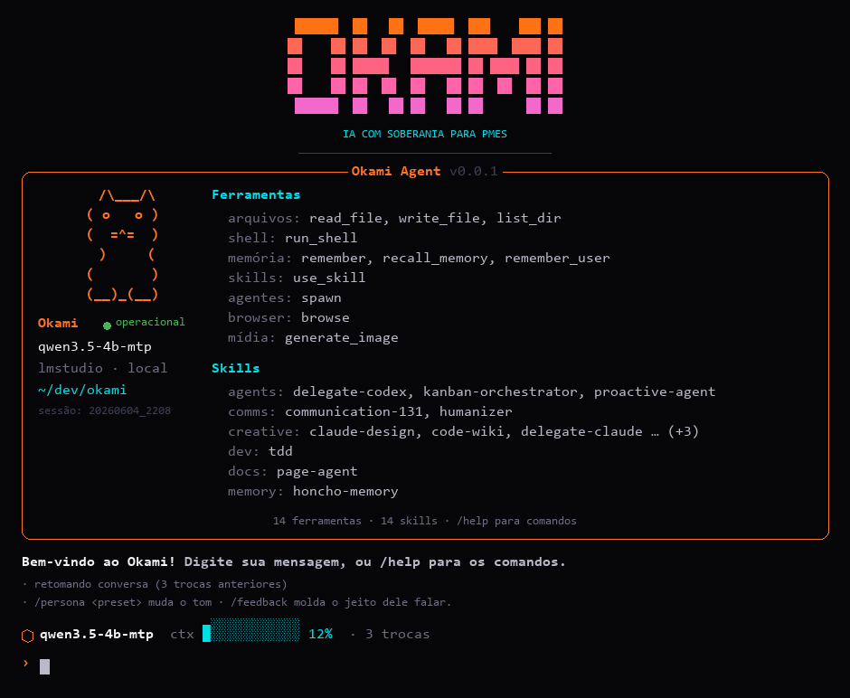
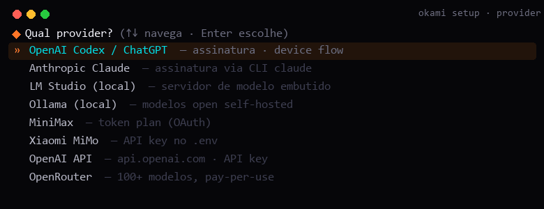

# Okami Agent

> **IA com soberania para PMEs.** Agente de codificação confiável, com paridade de capacidade
> entre LLMs, auto-melhoria (skills/persona/memória) e aderência obrigatória a design systems.

Veja [docs/ARCHITECTURE.md](docs/ARCHITECTURE.md) e [docs/ROADMAP.md](docs/ROADMAP.md).

## Preview

O `okami chat` abre um TUI na identidade da marca (Onyx + Heat Orange / Volt Cyan):



Toda a configuração é por menu de seta (`okami setup`, `okami provider add`):



## Status: Fase 0 (fundação)

Config + providers via LiteLLM + CLI `okami run`. Providers: **LMStudio** (local, já funciona),
**Codex/GPT**, **Claude**, **MiniMax**, **MiMo** (aguardando chaves/ids).

## Instalação

**O único pré-requisito é o `git`.** O instalador usa o [uv](https://docs.astral.sh/uv/) como motor —
ele baixa o Python, cria o ambiente isolado e instala tudo. **Você não precisa de Python instalado**,
e não tem dor de cabeça com long-path no Windows (o uv usa um diretório curto).

**Linux / macOS / WSL:**
```bash
curl -fsSL https://raw.githubusercontent.com/OkamiOps/Okami-Agent/main/scripts/install.sh | bash
```

**Windows (PowerShell):**
```powershell
irm https://raw.githubusercontent.com/OkamiOps/Okami-Agent/main/scripts/install.ps1 | iex
```

Depois (reabra o terminal se `okami` não for achado):
```bash
okami setup     # configura em 2-3 cliques (detecta seus providers)
okami chat      # conversa no terminal
```

<details><summary>Dev (rodar do código, sem instalar global)</summary>

```bash
uv sync                       # cria o venv + deps a partir do pyproject
uv run okami doctor           # roda sem ativar nada
# ou, editável global:  uv tool install -e .
```
Sem uv: `python -m venv .venv && . .venv/bin/activate && pip install -e ".[dev]"`
(no Windows, use um caminho curto p/ o venv — ex. `C:\okv` — por causa do long-path do litellm.)
</details>

### Docker (qualquer SO)
```bash
docker compose build
docker compose run --rm okami doctor
docker compose run --rm okami run "diga oi"
docker compose run --rm okami task "crie hello.txt" -e file_exists:hello.txt
# rodar os testes na imagem Linux:
docker run --rm --entrypoint python okami-agent -m pytest -q
```
> Para um LMStudio na máquina host, aponte `api_base` para `http://host.docker.internal:PORT/v1`.

## Uso

```powershell
okami                             # visão geral dos comandos (= okami help)
okami setup                       # assistente de configuração (menus de seta ↑↓)
okami setup provider              # pula direto pra uma seção (provider|memory|identity|channel)
okami provider add                # adiciona um modelo do catálogo (Codex, OpenAI, Ollama…) sem editar YAML
okami chat                        # conversa no terminal (TUI com sessão persistente)
okami chat "diga oi"              # uma pergunta e sai (scripts/pipe)
okami chat -a cto                 # conversa COMO um agente (agents/cto)
okami doctor                      # diagnostica config, chaves e conectividade
okami run "explique recursão" -p claude   # ida-e-volta crua (sem sessão/harness)
okami gateway                     # sobe os bots de Telegram (1 por agente)
```

Toda configuração é por **menu de seta** (↑↓ Enter); sem terminal interativo, cai num menu numerado.
Chaves de API vão pro `.env` (nunca pro `okami.yaml`, que é versionado).
Dentro do `okami chat`: `/help` `/new` `/status` `/stop` `/yolo` `/feedback <estilo>` `/persona <preset>` `/undo`.

> Sem instalar o entry point, dá para rodar com `python -m okami.cli ...`.

## Configuração

Providers em [`okami.yaml`](okami.yaml); chaves em `.env`. Cada provider tem `model`
(string LiteLLM), `api_base` opcional, `api_key_env`/`api_key` e `tier`
(`strong`/`weak`/`local`) — este último prepara o capability profile adaptativo (§3.5).
